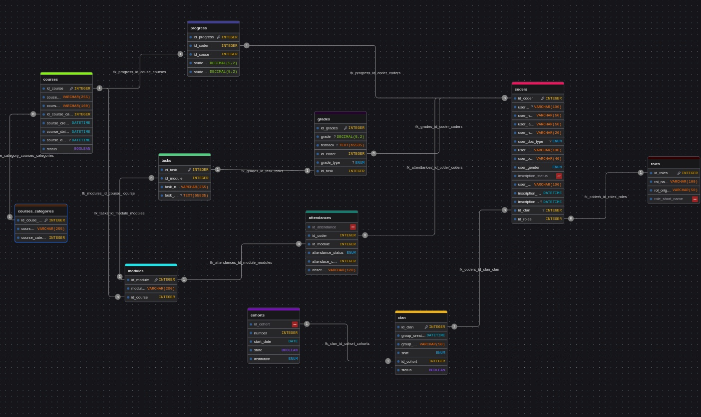

# 📚 Database Documentation `riwi_harvest_db`

## 1. General Description

The `riwi_harvest_db` database was designed to manage academic and institutional information related to:

- Students (coders) and their roles.  
- Academic performance (grades, tasks, progress).  
- Attendance records (attendances).  
- Institutional organization (cohorts, clans, courses, modules, and course categories).  

The main objective is to centralize and structure academic information, ensuring **data integrity, traceability, and scalability**. It also facilitates visualization for better decision-making and monitoring of both students and institutional growth.

---

## 2. Entity-Relationship Model

## 3. Table Relationships (Summary)

- **cohorts** 1 ────< **clan** (A cohort includes several clans).  
- **clan** 1 ────< **coders** (A clan contains multiple students).  
- **roles** 1 ────< **coders** (Each coder has a defined role).  
- **courses** 1 ────< **modules** (A course consists of several modules).  
- **courses_categories** 1 ────< **courses** (Each course belongs to a category).  
- **modules** 1 ────< **tasks** (Each module defines multiple tasks).  
- **tasks** 1 ────< **grades** (Each task can generate grades).  
- **modules** 1 ────< **attendances** (Each module records attendance).  
- **coders** 1 ────< **grades** (A student can have multiple grades).  
- **coders** 1 ────< **attendances** (A student can have multiple attendance records).  
- **coders** 1 ────< **progress** (A student has progress tracking in each course).  
- **courses** 1 ────< **progress** (Each course tracks student progress).  

---

## 4. Main Tables Overview

### 👤 Coders
Stores personal, academic, and registration details of students. Linked to **clan** and **roles**.

### 🛡️ Roles
Defines the roles assigned to coders (e.g., student, monitor, etc.).

### 📊 Grades
Stores student grades for each **task**, with grade types (module assessment, training, review).

### 📘 Tasks
Represents learning activities or assignments linked to **modules**.

### 🏹 Clan
Organizational grouping of students. Linked to **cohorts**.

### 📅 Cohorts
Represents a generation of students with a defined start date and institution.

### 📚 Modules
Components of a course. Linked to **courses**.

### 🎓 Courses
Academic programs offered, linked to **courses_categories**.

### 🗂️ Courses Categories
Classifies courses into categories (e.g., programming, design, etc.).

### 🕒 Attendances
Records attendance of coders per **module**, with codes:  
- **P** (Present)  
- **R** (Late)  
- **FI** (Unexcused absence)  
- **FJ** (Excused absence)  

### 📈 Progress
Tracks each coder’s overall progress and average grade per course.

---

## 5. Technical Notes

- **ENUM data types** ensure consistency in categorical fields (e.g., gender, doc type, inscription status, attendance status).  
- **FOREIGN KEYS** enforce referential integrity with `CASCADE` and `SET NULL` rules for controlled propagation of changes/deletions.  
- **UNIQUE constraints** applied to critical identifiers such as `email` and `document`.  
- **BOOLEAN status columns** manage logical deletion (active/inactive) instead of physical deletion.  
- **Scalability**: New cohorts, clans, roles, courses, modules, or categories can be added without altering core logic.  
- **Progress monitoring**: Introduced `progress` table for a more holistic view of student performance per course.  
